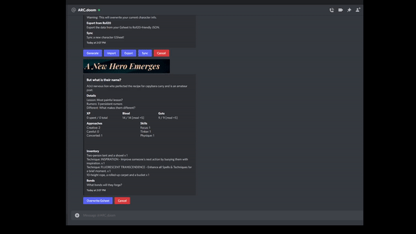
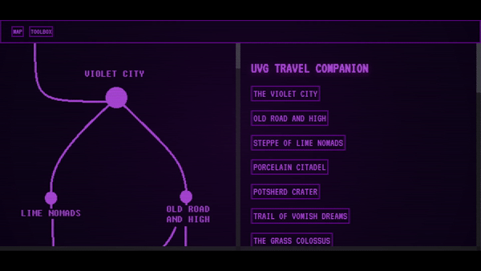

  <h1>Hi 👋, I'm Matthew Bozin</h1>
  <h3>A Los-Angeles-based full-stack software engineer at #100Devs</h3>
  
  
  

  

## About Me:

- 🔭 I’m currently working on [Caesura](https://caesura-poem-remixer.herokuapp.com/), [Together](https://github.com/Caleb-Cohen/Together), and [Food Oasis](https://foodoasis.la/)

- 👯 I’m looking to collaborate on **open source projects**

- 🤝 I’m happy to answer any questions, feel welcome to **reach out**!

- 👨‍💻 All of my projects are available at [https://matthewbozin.netlify.app/](https://matthewbozin.netlify.app/)

- 📫 How to reach me **mbozin94@gmail.com**

## Projects:

<table bordercolor="#66b2b2">
  
  <tr>
    <td width="50%" valign="top">
      <h3 align="center">Caesura</h3>
         
        
         
        

          
    
  
      

        
<strong>ReactJS, MaterialUI, Node.js, Express.js, MongoDB</strong> - Break down classic poems and remix them into new ones by rearranging lines and title words! Post your poems to a feed, comment with smaller poems, and snap along to your favorites!

    </td>
    <td width="50%" valign="top">
      <h3 align="center">SRDcat</h3>
         
      
         
        

    
  
      

        
<strong>ReactJS, Bootstrap, Javascript</strong> - Digital SRD companion app for the WizardThiefFighter Studio's SEACAT roleplaying game. Generate characters, roll skill checks, purchase/sell items, and make attacks using a mobile-friendly interface.

    </td>
  </tr>

  <tr>
  <td width="50%" valign="top">
    <h3 align="center">ARC.doom</h3>
     
    
     
    

  
      

        
<strong>DiscordJS, Node.js, Google Cloud API, Canvas</strong> - A Discord bot that helps play the award-winning ARC tabletop roleplaying game! Generate characters, sync up to character sheets using Google Cloud integration, manage a Doomsday Clock, and look up game terminology from the built-in SRD database.

    </td>
    <td width="50%" valign="top">
      <h3 align="center">UVG Digital Referee Screen</h3>
         
      
         
        

  
      

        
<strong>HTML, CSS, Javascript</strong> - A digital guide to the Ultraviolet Grasslands tabletop setting, featuring a digital version of every random table in the book!

    </td>
  </tr>
</table>

## Languages and Tools:

 

 
 

## My Stats:

&nbsp;

